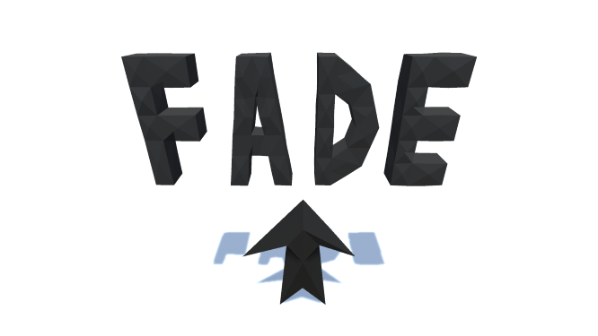

# Projects

## Fade

#### Fade was an entry to the 2021 Global Game Jam. "Lost and Found" was the theme.

Latest Release: [https://github.com/vanPhelan/Lost-And-Found/releases](https://github.com/vanPhelan/Lost-And-Found/releases)

Submission Page: [https://globalgamejam.org/2021/games/fade-9](https://globalgamejam.org/2021/games/fade-9)

Repository: [https://github.com/vanPhelan/Fade](https://github.com/vanPhelan/Fade)

## Maze Chaser

#### Maze Chaser is a simplistic game developed as an example for students. It uses no imported assets and is playable using mouse, keyboard, or gamepad, or touch screen.

Web Player: [https://vanphelan.github.io/Maze-Chaser/player/](https://vanphelan.github.io/Maze-Chaser/player/)

Repository: [https://github.com/vanPhelan/Maze-Chaser](https://github.com/vanPhelan/Maze-Chaser)
