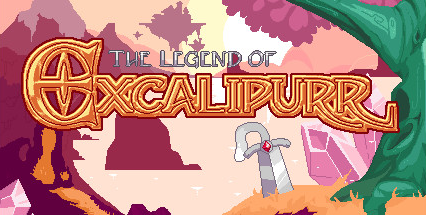

# Projects

## The Legend of Excalipurr

The Legend of Excalipurr is a retro action adventure game for which I was the sole programmer and designer. It was made in Game Maker Studio 2.

* [Steam Page](https://store.steampowered.com/app/618560/The_Legend_of_Excalipurr/)

## Fade

Fade was an entry to the 2021 Global Game Jam. "Lost and Found" was the theme. My responsibilities were programming and managing source control. Fade was created in Unity.

* [Repository](https://github.com/vanPhelan/Fade)
* [Submission Page](https://globalgamejam.org/2021/games/fade-9)
* [Latest Release](https://github.com/vanPhelan/Lost-And-Found/releases)

## Maze Chaser

Maze Chaser is a simplistic game developed as a Unity example for students. It uses no imported assets and is playable using mouse, keyboard, or gamepad, or touch screen.

* [Repository](https://github.com/vanPhelan/Maze-Chaser)
* [Web Player](https://vanphelan.github.io/Maze-Chaser/player/)

## Flappy Bird Tutorial

This is a beginner's tutorial for entry level Unity developers.

* [Repository](https://github.com/vanPhelan/Flappy-Bird-Tutorial)
